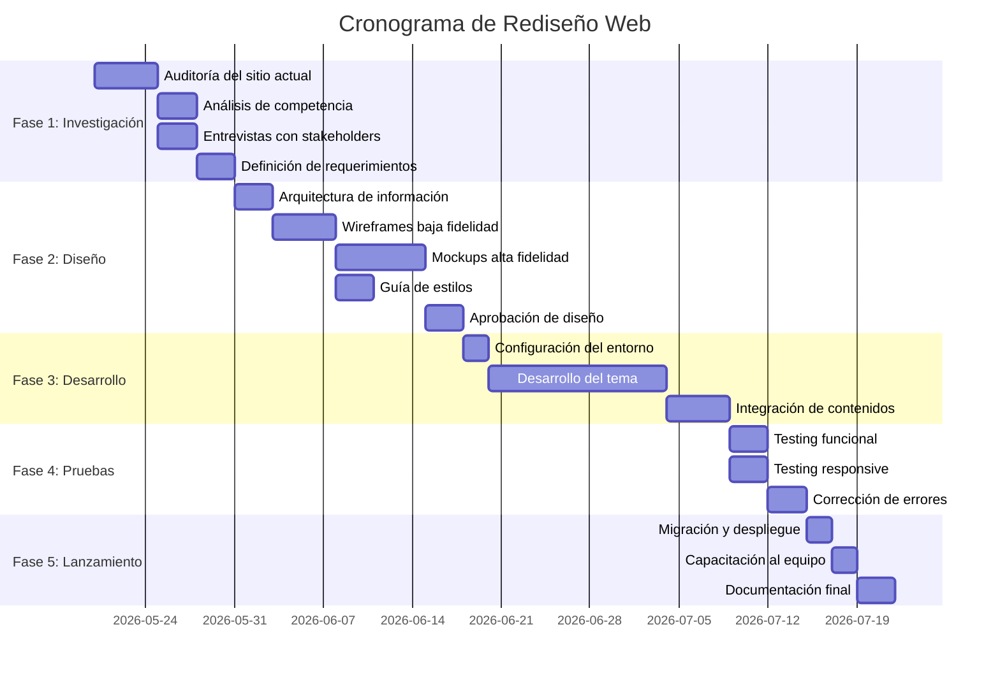
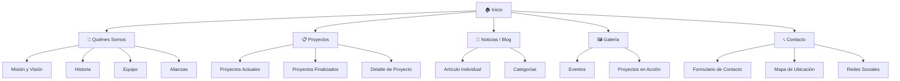

# 📋 Informe de Rediseño Web — Fundación Hecho en Bolivia
### Práctica Profesional / Pasantía 2026

---

## 📑 PARTE 1: Estructura Recomendada del Informe de Pasantía

Tu informe final de práctica profesional debería tener la siguiente estructura:

```
PORTADA
  - Título: "Rediseño y Reestructuración del Sitio Web de la Fundación Hecho en Bolivia"
  - Tu nombre completo
  - Carrera / Universidad
  - Tutor académico y tutor empresarial
  - Fecha

ÍNDICE

CAPÍTULO 1: INTRODUCCIÓN
  1.1 Antecedentes
  1.2 Planteamiento del Problema
  1.3 Objetivos (General y Específicos)
  1.4 Justificación
  1.5 Alcance y Limitaciones

CAPÍTULO 2: MARCO TEÓRICO
  2.1 Diseño Web y UX/UI
  2.2 Principios de Usabilidad (Nielsen)
  2.3 Diseño Responsive
  2.4 SEO y Accesibilidad Web
  2.5 Tecnologías Web (WordPress, Elementor, HTML/CSS/JS)
  2.6 Metodología de Desarrollo Web

CAPÍTULO 3: DIAGNÓSTICO DEL SITIO ACTUAL
  3.1 Auditoría Técnica
  3.2 Auditoría de Contenido
  3.3 Auditoría de UX/UI
  3.4 Auditoría SEO
  3.5 Análisis de Competencia (benchmarking)
  3.6 Resumen de Problemas Encontrados

CAPÍTULO 4: PROPUESTA DE REDISEÑO
  4.1 Arquitectura de Información (nuevo mapa del sitio)
  4.2 Wireframes (bocetos de baja fidelidad)
  4.3 Mockups (diseño de alta fidelidad)
  4.4 Guía de Estilos (colores, tipografías, componentes)
  4.5 Diseño Responsive (mobile, tablet, desktop)

CAPÍTULO 5: DESARROLLO E IMPLEMENTACIÓN
  5.1 Tecnologías Utilizadas
  5.2 Estructura del Proyecto
  5.3 Desarrollo Frontend
  5.4 Integración de Contenidos
  5.5 Pruebas y Control de Calidad

CAPÍTULO 6: RESULTADOS
  6.1 Comparativa Antes vs. Después
  6.2 Métricas de Rendimiento
  6.3 Cumplimiento de Objetivos

CAPÍTULO 7: CONCLUSIONES Y RECOMENDACIONES
  7.1 Conclusiones
  7.2 Recomendaciones
  7.3 Trabajo Futuro

ANEXOS
  - Capturas de pantalla del sitio anterior
  - Wireframes y bocetos
  - Código fuente relevante
  - Actas de reuniones
  - Cronograma ejecutado

BIBLIOGRAFÍA
```

---

## 📑 PARTE 2: AUDITORÍA DEL SITIO ACTUAL

> [!CAUTION]
> El sitio web actual tiene **problemas críticos** que afectan gravemente la experiencia del usuario y la credibilidad de la fundación.

### 🔍 Datos Técnicos del Sitio Actual

| Aspecto | Detalle |
|---------|---------|
| **URL** | `https://www.fundacionhechoenbolivia.com/fundacionhb/` |
| **CMS** | WordPress 7.0 |
| **Theme** | Hello Elementor 2.4.0 |
| **Page Builder** | Elementor 3.30.3 + Elementor Pro 3.23.1 |
| **Header/Footer** | Header Footer Elementor Plugin 2.4.5 |
| **Caché** | LiteSpeed Cache 7.2 |
| **Analytics** | Google Analytics (G-9L1REGKZED) |
| **Tipografías** | Roboto, Roboto Slab (servidas localmente) |
| **Favicon** | GIF animado de Bolivia (cropped-Bolivia.gif) |

---

### 🔴 ERRORES CRÍTICOS ENCONTRADOS

#### 1. Enlaces Rotos / Páginas 404

| Página | URL | Estado |
|--------|-----|--------|
| Contacto | `/fundacionhb/contacto/` | ❌ **404 Not Found** |
| Proyectos | `/fundacionhb/proyectos/` | ❌ **404 Not Found** |
| Galería | `/fundacionhb/galeria/` | ❌ **404 Not Found** |
| Noticias | `/fundacionhb/noticias/` | ❌ **404 Not Found** |

> [!WARNING]
> **4 de las páginas principales del menú de navegación están rotas.** Esto significa que los visitantes hacen clic en los botones del menú y reciben un error. Esto es **INACEPTABLE** para una fundación que busca credibilidad.

#### 2. Página "Quiénes Somos" — Problemas Graves

- El título dice **"Quienes Somos borrador"** — ¡la palabra "borrador" quedó visible al público!
- El contenido está envuelto en etiqueta `<sup>` (superíndice), lo que hace el texto **diminuto e ilegible**
- La página usa el **template por defecto de WordPress** en vez de Elementor, mostrando un diseño completamente diferente al de la página principal
- **No tiene el header/footer personalizado** de Elementor, se ve el genérico de Hello Elementor
- No tiene imágenes ni diseño visual alguno

#### 3. Página de Archivos/Blog

- Contiene entradas de prueba: **"¡Hola, mundo!"** (el contenido por defecto de WordPress) — esto se ve completamente amateur
- Entrada "Elementor #33" con contenido de placeholder Lorem Ipsum
- Hay **dos entradas** con el mismo título "¡Hola, mundo!"

#### 4. Problemas de SEO

| Problema | Detalle |
|----------|---------|
| Sin meta description | La página principal no tiene `<meta name="description">` |
| Título genérico | Solo dice "Fundacion Hecho en Bolivia" sin descripción |
| Contenido duplicado | Páginas de blog duplicadas con mismo título |
| Favicon GIF | Usar GIF como favicon no es práctica estándar (mejor PNG/SVG/ICO) |
| Sin Open Graph | No hay tags para compartir en redes sociales |
| Sin Schema.org | No hay datos estructurados para la fundación |

#### 5. Problemas de Seguridad / Protocolo

- **Mezcla HTTP/HTTPS**: Algunas fuentes de Elementor y recursos se cargan por `http://` en vez de `https://` 
  - Ejemplo: `http://www.fundacionhechoenbolivia.com/fundacionhb/wp-content/uploads/elementor/google-fonts/css/roboto.css`
  - Las imágenes del slideshow se cargan por `http://`
  - Esto genera **advertencias de contenido mixto** en los navegadores

#### 6. Problemas de Rendimiento

- **Exceso de archivos CSS**: Se cargan al menos **20+ hojas de estilo** separadas
- CSS duplicado: `elementor-icons` se carga dos veces (versión 5.43.0 y 5.34.0)
- `font-awesome` se carga en múltiples versiones
- No hay optimización visible de imágenes (no usan WebP)
- El slideshow carga imágenes pesadas (JPG/PNG originales)

#### 7. Problemas de Diseño / UX

- **Inconsistencia visual**: La página principal usa Elementor Canvas, pero las internas usan el theme por defecto
- **No hay diseño responsive verificable** — los breakpoints solo están definidos por Elementor
- El header personalizado de Elementor solo aparece en la página principal
- **No hay call-to-action claro** en la página principal
- Los íconos sociales y de contacto no parecen estar vinculados correctamente
- El footer no tiene información de contacto real

#### 8. Problemas de Contenido

- Imágenes del slideshow son de 2021 (contenido desactualizado)
- No hay información de contacto visible (teléfono, dirección, email)
- No hay formulario de contacto funcional
- No hay mapa de ubicación
- Falta contenido sobre proyectos realizados
- Falta equipo de trabajo / organigrama

---

## 📑 PARTE 3: PROCESO COMPLETO DE REDISEÑO (Paso a Paso)

### 📅 Cronograma Sugerido (8-12 semanas)



---

### 🔵 FASE 1: INVESTIGACIÓN Y DIAGNÓSTICO (Semanas 1-2)

#### 1.1 Auditoría del Sitio Actual ✅ (Ya realizada arriba)

Herramientas recomendadas para documentar:
- **Google Lighthouse** → rendimiento, accesibilidad, SEO, mejores prácticas
- **GTmetrix** → velocidad de carga y optimización
- **Screaming Frog** → rastreo de enlaces rotos y estructura del sitio
- **WAVE** → errores de accesibilidad
- **Google Search Console** → errores de indexación
- **Capturas de pantalla** → documentar el estado actual (móvil + desktop)

> [!TIP]
> Toma capturas de pantalla de TODAS las páginas del sitio actual antes de hacer cualquier cambio. Esto es tu "antes" para la comparativa del informe.

#### 1.2 Análisis de Competencia (Benchmarking)

Analiza al menos 3-5 sitios de fundaciones similares en Bolivia y Latinoamérica:

| Fundación | URL | Qué analizar |
|-----------|-----|-------------|
| Fundación PUMA | fundacionpuma.org | Estructura, diseño, contenido |
| Fundación Boliviana para el Desarrollo | Buscar | Navegación, UX |
| Fundación Tierra | fundaciontierra.org | Proyectos, galería |
| Fundación Jubileo | jubileobolivia.org.bo | Blog, noticias |
| Otra fundación local | - | Formularios, contacto |

Para cada sitio, documenta:
- ✅ Qué hacen bien
- ❌ Qué hacen mal
- 💡 Ideas que puedes adaptar

#### 1.3 Entrevistas / Reuniones

Entrevista al personal de la fundación:
- ¿Cuál es el **objetivo principal** del sitio web? (informar, captar donaciones, mostrar proyectos, etc.)
- ¿Quién es el **público objetivo**? (donantes, voluntarios, empresas, gobierno, público general)
- ¿Qué **contenido** es prioritario?
- ¿Necesitan **funcionalidades especiales**? (formularios, pagos, login, etc.)
- ¿Tienen **manual de marca** o logo en alta resolución?
- ¿Qué **redes sociales** usan activamente?

#### 1.4 Documento de Requerimientos

Crea un documento con:
- **Requerimientos funcionales**: qué debe hacer el sitio
- **Requerimientos no funcionales**: velocidad, seguridad, responsive
- **Contenido necesario**: textos, imágenes, videos, documentos
- **Restricciones**: presupuesto, tiempo, hosting actual

---

### 🟢 FASE 2: DISEÑO (Semanas 3-5)

#### 2.1 Arquitectura de Información — Mapa del Sitio Propuesto



#### 2.2 Wireframes (Bocetos de Baja Fidelidad)

Herramientas recomendadas:
- **Papel y lápiz** → para los primeros bocetos rápidos
- **Figma** (gratis) → para wireframes digitales
- **Balsamiq** → para wireframes de baja fidelidad rápidos
- **Excalidraw** → para diagramas y flujos

Páginas a bocetar:
1. ☐ Página de Inicio (Hero, secciones, CTA)
2. ☐ Quiénes Somos (contenido institucional)
3. ☐ Proyectos (grid de tarjetas)
4. ☐ Detalle de Proyecto (layout individual)
5. ☐ Noticias/Blog (listado + artículo)
6. ☐ Galería (grid de imágenes/lightbox)
7. ☐ Contacto (formulario + mapa)
8. ☐ Header y Footer (componentes globales)

> [!IMPORTANT]
> Diseña siempre **Mobile First** — primero la versión móvil, luego tablet, luego desktop.

#### 2.3 Guía de Estilos (Design System)

Define y documenta:

**Paleta de Colores:**
| Uso | Color Sugerido | Hex |
|-----|---------------|-----|
| Primario (Bolivia - rojo) | Rojo intenso | `#CE1126` |
| Secundario (Bolivia - amarillo) | Dorado cálido | `#F9B612` |
| Terciario (Bolivia - verde) | Verde esperanza | `#007934` |
| Fondo principal | Blanco cálido | `#FAFAF8` |
| Fondo oscuro | Gris oscuro | `#1A1A2E` |
| Texto principal | Negro suave | `#2D2D2D` |
| Texto secundario | Gris medio | `#6B7280` |
| Acento/CTA | Azul confianza | `#1E40AF` |

**Tipografías Recomendadas:**
- **Títulos**: Montserrat o Poppins (bold, modernas)
- **Cuerpo**: Inter o Open Sans (legibles)
- **Tamaños**: definir escala tipográfica (h1 a h6, body, small)

**Componentes a definir:**
- Botones (primario, secundario, outline, ghost)
- Tarjetas (proyecto, noticia, equipo)
- Formularios (inputs, selects, textarea)
- Navegación (menú desktop, menú móvil)
- Footer (contacto, links, redes)
- Iconografía (estilo consistente)

#### 2.4 Mockups de Alta Fidelidad

Herramientas:
- **Figma** (recomendado, gratis, colaborativo)
- **Adobe XD** (alternativa)
- **Canva** (para diseño básico)

Para cada página, crear:
- Versión **Desktop** (1440px)
- Versión **Tablet** (768px)
- Versión **Mobile** (375px)

> [!TIP]
> Presenta los mockups a la fundación para **aprobación formal** antes de empezar a desarrollar. Documenta la aprobación con un acta firmada.

---

### 🟡 FASE 3: DESARROLLO (Semanas 6-9)

#### 3.1 Decisión Tecnológica

Tienes dos caminos principales:

| Opción | Ventajas | Desventajas |
|--------|----------|-------------|
| **WordPress + Elementor (mejorado)** | Personal existente puede editar, hosting actual compatible | Limitaciones de diseño, rendimiento pesado |
| **Sitio estático (HTML/CSS/JS)** | Máximo control, ultra rápido, SEO superior | Requiere conocimientos técnicos para editar |
| **WordPress + Theme personalizado** | Balance entre control y facilidad | Mayor tiempo de desarrollo |
| **Next.js / Vite (SPA/SSG)** | Moderno, rápido, escalable | Requiere hosting diferente, más complejo |

> [!IMPORTANT]
> Considera que la fundación probablemente necesita poder **editar contenido sin programar**. WordPress con un theme hijo bien estructurado o con Elementor Pro bien configurado puede ser la mejor opción.

#### 3.2 Checklist de Desarrollo

**Estructura HTML semántica:**
- ☐ `<header>` con navegación accesible
- ☐ `<main>` con contenido principal
- ☐ `<section>` para cada bloque de contenido
- ☐ `<article>` para posts/proyectos
- ☐ `<footer>` con información completa
- ☐ `<nav>` para menús
- ☐ Jerarquía de encabezados correcta (un solo `<h1>` por página)

**CSS / Estilos:**
- ☐ Variables CSS para colores y tipografías
- ☐ Layout con CSS Grid y Flexbox
- ☐ Media queries para responsive
- ☐ Animaciones sutiles (transitions, transforms)
- ☐ Modo oscuro (opcional pero impresiona)

**JavaScript:**
- ☐ Menú hamburguesa para móvil
- ☐ Slider/carrusel de imágenes
- ☐ Lazy loading de imágenes
- ☐ Smooth scrolling
- ☐ Lightbox para galería
- ☐ Validación de formularios
- ☐ Animaciones al hacer scroll (Intersection Observer)

**SEO:**
- ☐ Meta titles únicos por página
- ☐ Meta descriptions únicas
- ☐ Open Graph tags para redes sociales
- ☐ Schema.org (Organization, Project)
- ☐ Sitemap XML
- ☐ robots.txt
- ☐ URLs amigables

**Accesibilidad:**
- ☐ Alt text en todas las imágenes
- ☐ Contraste de colores WCAG AA
- ☐ Navegación por teclado
- ☐ Etiquetas ARIA donde necesario
- ☐ Focus visible en elementos interactivos
- ☐ Formularios con labels asociados

**Rendimiento:**
- ☐ Imágenes optimizadas (WebP, comprimidas)
- ☐ CSS y JS minificados
- ☐ Lazy loading
- ☐ Caché del navegador
- ☐ Compresión GZIP/Brotli

---

### 🟠 FASE 4: PRUEBAS Y CONTROL DE CALIDAD (Semanas 10-11)

#### 4.1 Testing Funcional

Verificar en cada página:
- ☐ Todos los enlaces funcionan (no hay 404)
- ☐ Formularios envían correctamente
- ☐ Imágenes se cargan
- ☐ Videos se reproducen
- ☐ Menú de navegación funciona
- ☐ Botones de redes sociales abren perfiles correctos
- ☐ Botón "scroll to top" funciona
- ☐ Google Analytics está configurado

#### 4.2 Testing Responsive

Probar en:
- ☐ iPhone SE (320px)
- ☐ iPhone 14 (390px)
- ☐ Samsung Galaxy (360px)
- ☐ iPad Mini (768px)
- ☐ iPad Pro (1024px)
- ☐ Laptop (1366px)
- ☐ Desktop (1920px)

Probar en navegadores:
- ☐ Google Chrome
- ☐ Mozilla Firefox
- ☐ Safari (si es posible)
- ☐ Microsoft Edge

#### 4.3 Testing de Rendimiento

Herramientas:
- **Google Lighthouse** → apuntar a score 90+ en todas las categorías
- **PageSpeed Insights** → velocidad real
- **WebPageTest** → métricas detalladas

Métricas objetivo:
| Métrica | Objetivo |
|---------|----------|
| LCP (Largest Contentful Paint) | < 2.5s |
| FID (First Input Delay) | < 100ms |
| CLS (Cumulative Layout Shift) | < 0.1 |
| Score general Lighthouse | > 90 |

#### 4.4 Testing SEO

- ☐ Verificar con Google Search Console
- ☐ Probar con Screaming Frog
- ☐ Verificar meta tags con metatags.io
- ☐ Probar compartir en WhatsApp, Facebook, Twitter (preview)

---

### 🔵 FASE 5: LANZAMIENTO Y ENTREGA (Semana 12)

#### 5.1 Pre-lanzamiento
- ☐ Backup completo del sitio actual
- ☐ Verificar DNS y SSL
- ☐ Configurar redirecciones 301 (URLs antiguas → nuevas)
- ☐ Verificar formulario de contacto en producción
- ☐ Configurar Google Analytics y Search Console
- ☐ Enviar sitemap a Google

#### 5.2 Lanzamiento
- ☐ Desplegar en producción
- ☐ Verificar todo funcione en vivo
- ☐ Monitorear errores las primeras 48 horas

#### 5.3 Post-lanzamiento
- ☐ Capacitar al equipo de la fundación para editar contenido
- ☐ Crear manual de usuario básico
- ☐ Entregar documentación técnica
- ☐ Entregar credenciales y accesos

---

## 📑 PARTE 4: ENTREGABLES POR FASE

| Fase | Entregable | Formato |
|------|-----------|---------|
| Investigación | Informe de auditoría | PDF/Word |
| Investigación | Análisis de competencia | PDF/Word |
| Investigación | Documento de requerimientos | PDF/Word |
| Diseño | Mapa del sitio | Diagrama (Figma/PNG) |
| Diseño | Wireframes | Figma/PDF |
| Diseño | Mockups finales | Figma/PDF |
| Diseño | Guía de estilos | Figma/PDF |
| Desarrollo | Código fuente | Repositorio Git |
| Desarrollo | Sitio funcionando | URL en vivo |
| Pruebas | Reporte de testing | PDF/Word |
| Pruebas | Capturas Lighthouse | PNG/PDF |
| Lanzamiento | Manual de usuario | PDF |
| Lanzamiento | Documentación técnica | PDF/MD |
| Lanzamiento | Informe final de pasantía | PDF encuadernado |

---

## 📑 PARTE 5: CONSEJOS ADICIONALES PARA TU PASANTÍA

### 📸 Documenta TODO

- Toma **capturas de pantalla** en cada fase
- Guarda **versiones** de tus diseños (v1, v2, v3...)
- Registra las **reuniones** con actas breves
- Lleva un **diario de trabajo** semanal

### 🎨 Herramientas Gratuitas Recomendadas

| Herramienta | Uso | URL |
|-------------|-----|-----|
| Figma | Diseño UI/UX | figma.com |
| Visual Studio Code | Editor de código | code.visualstudio.com |
| Git + GitHub | Control de versiones | github.com |
| Google Lighthouse | Auditoría web | DevTools de Chrome |
| Unsplash | Imágenes gratuitas | unsplash.com |
| Font Awesome | Íconos | fontawesome.com |
| Google Fonts | Tipografías | fonts.google.com |
| Coolors | Paletas de color | coolors.co |
| TinyPNG | Comprimir imágenes | tinypng.com |
| Canva | Diseño gráfico rápido | canva.com |

### 📝 Resumen de Problemas Priorizados

| Prioridad | Problema | Impacto |
|-----------|----------|---------|
| 🔴 Crítico | 4 páginas con error 404 | Usuarios no pueden acceder a contenido |
| 🔴 Crítico | "Quiénes Somos" dice "borrador" | Imagen no profesional |
| 🔴 Crítico | Contenido de prueba "Hola Mundo" visible | Falta de profesionalismo |
| 🟠 Alto | Mezcla HTTP/HTTPS (contenido mixto) | Advertencias de seguridad en navegadores |
| 🟠 Alto | Sin meta descriptions ni SEO | Invisible en Google |
| 🟡 Medio | CSS duplicado y excesivo | Rendimiento lento |
| 🟡 Medio | Imágenes sin optimizar | Carga lenta |
| 🟡 Medio | Inconsistencia visual entre páginas | UX confusa |
| 🟢 Bajo | Favicon en formato GIF | No estándar |
| 🟢 Bajo | Sin datos estructurados | SEO avanzado |

---

> [!NOTE]
> Este informe fue generado a partir del análisis técnico del sitio web actual al 20 de mayo de 2026. Se recomienda actualizarlo conforme avance el proyecto de rediseño.
